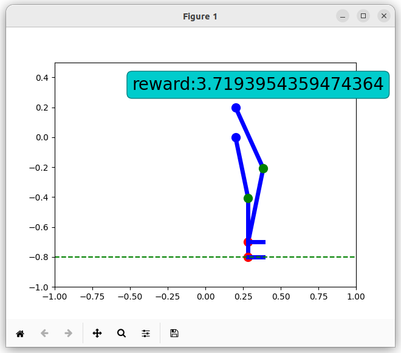
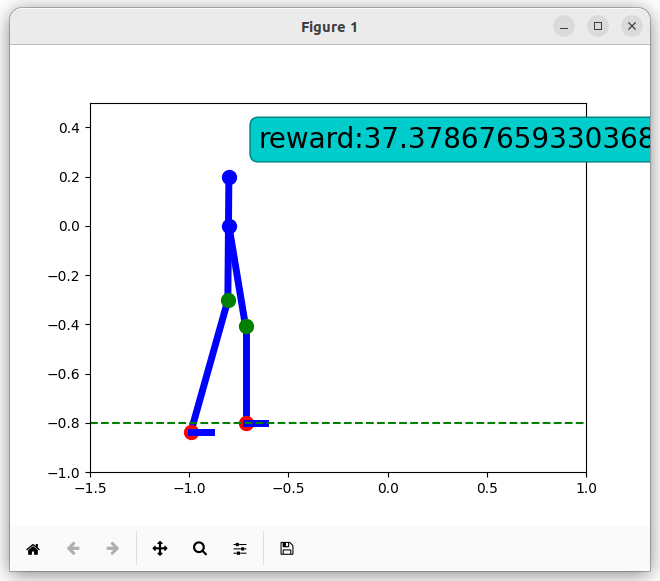
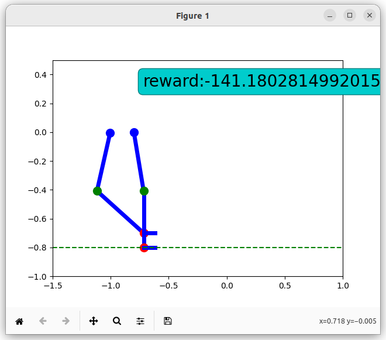
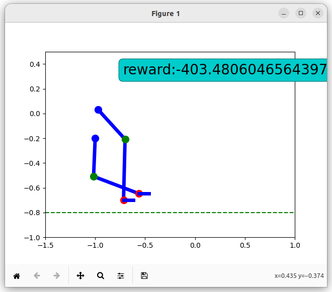

# ExoscheletonRLSimulationLearning

The purpose of this project is to have a simulation of a bipedal exoskeleton and to train a Reinforcement Learning (RL) algorithm to correctly activate the 3 actuators on each leg in such a way, that the exoskeleton (later with a person inside) would be able to walk.

This is the first stage of the simulation. In the next stage, a 3D model will be developed and the RL algorithm will be improved.

## RL algorithm

### States
TODO

### Actions
TODO

### Rewards
TODO

Example of positive rewards:

  
&nbsp; &nbsp; &nbsp; &nbsp;
  

Example of negative rewards:

  
&nbsp; &nbsp; &nbsp; &nbsp;
  

